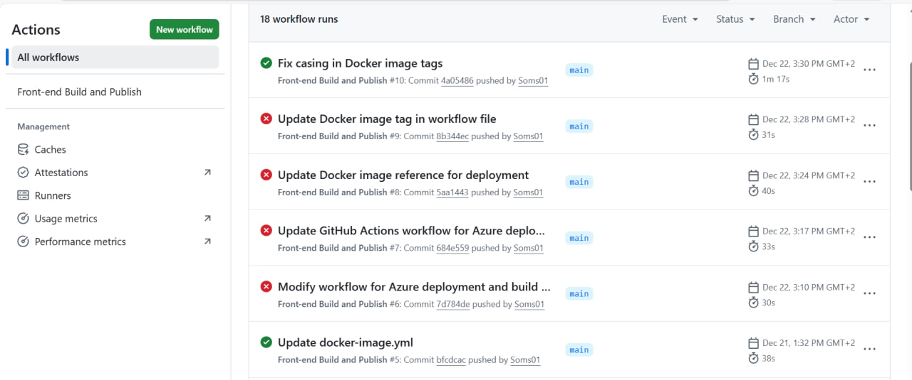
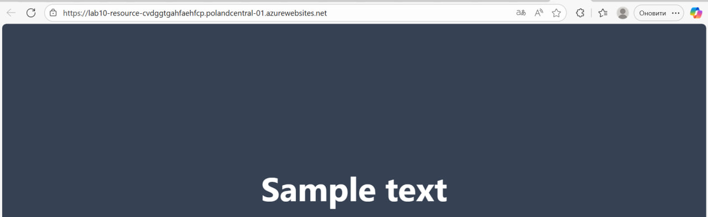

# Звіт з практичної роботи №12
**Тема:** Неперервна доставка (Continuous Delivery)
**Виконав:** Осипенко Роман ІПЗ-3.01

---

## 1. Мета роботи
Налаштувати автоматичне розгортання (деплой) Docker-контейнера з веб-застосунком у хмарне середовище Microsoft Azure за допомогою GitHub Actions.

---

## 2. Виконання роботи

### Крок 1: Налаштування середовища Azure
1.  У порталі Azure створено ресурс **Web App for Containers** під назвою `Soms01-lab10-app`.
2.  Обрано регіон **Poland Central** та тарифний план **Free (F1)**.
3.  Створено **Service Principal** для надання доступу GitHub Actions до ресурсів Azure.

### Крок 2: Налаштування репозиторію GitHub
1.  Отримано JSON-ключі доступу (`clientId`, `clientSecret`, `subscriptionId`, `tenantId`).
2.  Додано секрет `AZURE_CREDENTIALS` у налаштування репозиторію.

### Крок 3: Модифікація CI/CD Workflow
До файлу `.github/workflows/docker-image.yml` додано нову задачу `deploy`, яка виконується після успішної збірки.

**Фінальний код Workflow:**
```yaml
name: Front-end Build and Publish

on:
  workflow_dispatch:
  push:
    branches:
      - 'main'
      - 'feature/*'

permissions:
  contents: read
  packages: write

jobs:
  # --- JOB 1: ЗБІРКА (Те, що у вас вже працює) ---
  build-and-push:
    runs-on: ubuntu-latest
    
    steps:
      - name: Checkout repository
        uses: actions/checkout@v4

      - name: Install pnpm, dependencies and build
        run: |
          npm install -g pnpm
          pnpm install
          pnpm run build

      - name: Log in to the Container registry
        uses: docker/login-action@v3
        with:
          registry: ghcr.io
          username: ${{ github.actor }}
          password: ${{ secrets.GITHUB_TOKEN }}

      - name: Build and push Docker image
        uses: docker/build-push-action@v5
        with:
          context: .
          push: true
          # Використовуємо ваш тег
          tags: ghcr.io/soms01/projeck02:latest

  # --- JOB 2: ДЕПЛОЙ В AZURE (Нова частина) ---
  deploy:
    runs-on: ubuntu-latest
    needs: build-and-push  # Чекаємо, поки завершиться збірка
    
    steps:
      - name: Azure Login
        uses: azure/login@v2
        with:
          creds: ${{ secrets.AZURE_CREDENTIALS }}

      - name: Deploy to Azure Web App
        uses: azure/webapps-deploy@v2
        with:
          app-name: Lab10-Resource
          images: ghcr.io/Soms01/projeck02:latest
```

## Результати

### *1. Успішне виконання Pipeline:*


### *2. Працюючий сайт:*

